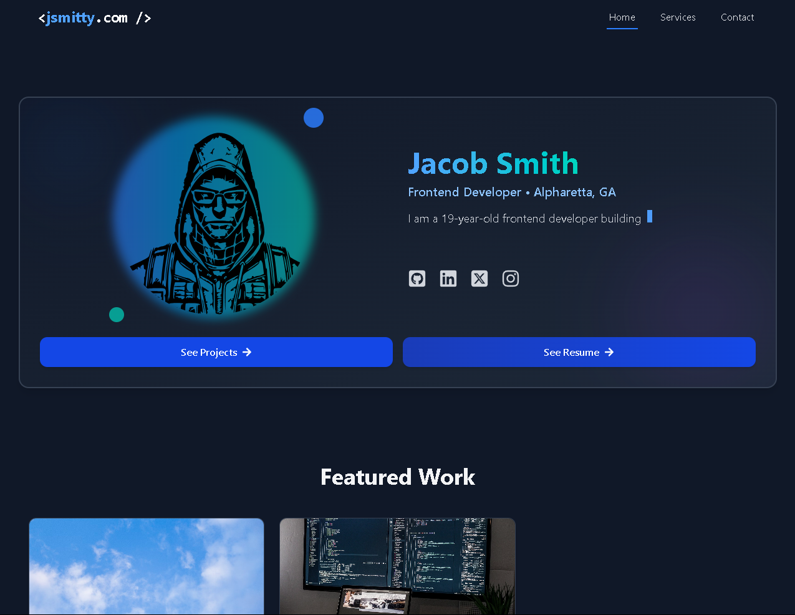

# 🚀 JSmitty Portfolio

A modern, animated React portfolio showcasing web development skills and services.



## ✨ Features

- **Animated UI** - Smooth transitions and micro-interactions using Framer Motion
- **Dark Mode Design** - Sleek dark-themed interface for a professional look
- **Responsive Layout** - Fully mobile-responsive from small phones to large desktops
- **Contact Form** - Professional EmailJS integration with auto-replies
- **Service Showcase** - Filterable services gallery with detailed descriptions
- **React Router** - Client-side routing for seamless page transitions
- **Performance Optimized** - Fast load times and smooth animations

## 📋 Pages

- **Home** - Introduction, projects, experience, skills, and testimonials
- **Services** - Comprehensive list of services with category filtering
- **Contact** - Advanced contact form with EmailJS integration and interactive elements

## 🛠️ Technologies

- **Frontend Framework**: [React](https://reactjs.org/)
- **Build Tool**: [Vite](https://vitejs.dev/)
- **Styling**: [Tailwind CSS](https://tailwindcss.com/)
- **Animations**: [Framer Motion](https://www.framer.com/motion/)
- **Routing**: [React Router](https://reactrouter.com/)
- **Email Integration**: [EmailJS](https://www.emailjs.com/)
- **Icons**: [React Icons](https://react-icons.github.io/react-icons/)

## 🚀 Installation & Setup

1. **Clone the repository**

```bash
git clone https://github.com/yourusername/portfolio.git
cd portfolio
```

2. **Install dependencies**

```bash
npm install
```

3. **Set up environment variables**

Create a `.env` file in the root directory:

```
VITE_EMAILJS_PUBLIC_KEY=your_emailjs_public_key
```

4. **Start the development server**

```bash
npm run dev
```

5. **Build for production**

```bash
npm run build
```

## 📬 EmailJS Configuration

1. Create an account at [EmailJS](https://www.emailjs.com/)
2. Set up a service (Gmail, Outlook, etc.)
3. Create two email templates:
   - Main notification template (for you to receive messages)
   - Auto-reply template (for users to receive confirmation)
4. Get your Service ID, Template IDs, and Public Key
5. Update the ContactPage component with your IDs

## 📁 Project Structure

```
portfolio/
├── public/           # Static files
├── src/              # Source files
│   ├── components/   # Reusable components
│   ├── data/         # JSON data files
│   ├── pages/        # Page components
│   ├── App.jsx       # Main app component
│   └── main.jsx      # Entry point
├── .env              # Environment variables
├── package.json      # Dependencies
├── tailwind.config.js # Tailwind configuration
└── vite.config.js    # Vite configuration
```

## 🎨 Key Components

- **AnimatedHeader**: Fixed navigation with scroll-aware highlighting
- **ContactForm**: Interactive form with real-time feedback and animations
- **ServicesGrid**: Filterable services showcase with animated cards
- **Testimonials**: Auto-rotating testimonial carousel
- **SkillsSection**: Animated skills showcase
- **ProjectsGrid**: Featured projects with hover interactions

## 🔍 Future Improvements

- Blog section for sharing web development insights
- Dark/light theme toggle
- Project detail pages
- Internationalization support
- Integration with GitHub API to show live repositories

## 📚 Resources

- [Tailwind CSS Docs](https://tailwindcss.com/docs)
- [Framer Motion API](https://www.framer.com/api/motion/)
- [EmailJS Documentation](https://www.emailjs.com/docs/)
- [React Router Documentation](https://reactrouter.com/docs/en/v6)

## 📝 License

MIT © [Your Name]

---

## 🙏 Acknowledgments

- Icons from [React Icons](https://react-icons.github.io/react-icons/)
- Design inspiration from [Dribbble](https://dribbble.com/)

---

*Made with ❤️ by JSmitty*