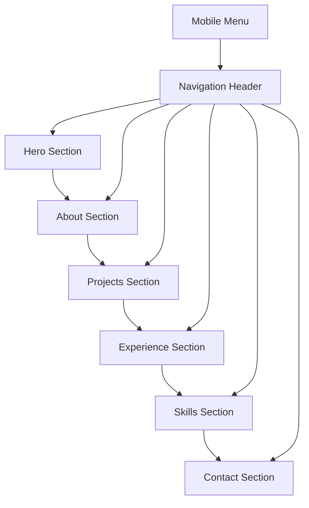

# Spider-Man Themed Portfolio Website - Detailed Plan

## Project Overview
Create a fully responsive Spider-Man themed portfolio website for Jacob Smith, balancing professional presentation with subtle theming suitable for internship applications.

## Architecture Overview

### File Structure
```
/home/jsmitty/Github/jsmitty-portfolio/
├── index.html          # Main HTML file with semantic structure
├── styles.css          # Responsive CSS with mobile-first design
├── script.js           # Vanilla JS for interactivity
├── assets/             # Static assets
│   ├── favicon.png
│   └── headshot.jpg
└── plan.md             # This planning document
```

### Technology Stack
- HTML5 with semantic elements
- CSS3 with Flexbox/Grid and CSS custom properties
- Vanilla JavaScript (ES6+)
- Font Awesome for icons
- Google Fonts for typography
- EmailJS for contact form

## Design System

### Color Palette
```css
:root {
  --primary-red: #B22222;      /* Professional Spider-Man red (firebrick) */
  --secondary-blue: #191970;  /* Midnight blue - more professional */
  --accent-gray: #A9A9A9;     /* Darker gray for sophistication */
  --background: #FFFFFF;      /* Clean white */
  --text-dark: #2C2C2C;       /* Darker text for better contrast */
  --text-light: #555555;      /* Adjusted light text */
}
```

### Typography
- Primary Font: Roboto (Google Fonts) - Professional and readable
- Secondary Font: Roboto Mono for code snippets
- Font Sizes: Mobile-first scaling (16px base, responsive units)

### Layout Grid
- Mobile: Single column, stacked sections
- Tablet: 2-column grid for cards/projects
- Desktop: Full-width sections with max-width containers

## Component Architecture

### Navigation Component
- Fixed header with logo/title
- Desktop: Horizontal nav with hover effects
- Mobile: Hamburger menu with overlay
- Smooth scroll to sections

### Hero Section
- Full viewport height
- Background with subtle web pattern (CSS/SVG)
- Centered content: Name, title, quote, CTA button
- Responsive text sizing

### Content Sections
1. **About**: Bio with headshot, professional summary
2. **Projects**: Card grid with CentLedger and Portfolio details
3. **Experience**: Timeline/cards for Code Ninjas and Tennis Warehouse
4. **Skills**: Icon grid with proficiency levels
5. **Contact**: Form with EmailJS integration, social links

### Interactive Elements
- Smooth scrolling navigation
- Mobile menu animations
- Hover effects on cards/buttons
- Form validation feedback
- Scroll-triggered animations (subtle)

## Responsive Breakpoints
- Mobile: 320px - 767px
- Tablet: 768px - 1023px
- Desktop: 1024px+

## Implementation Phases

### Phase 1: Foundation
1. Create semantic HTML structure
2. Set up CSS custom properties and base styles
3. Implement mobile-first responsive grid
4. Add Google Fonts and Font Awesome

### Phase 2: Layout & Navigation
1. Build fixed navigation header
2. Create mobile hamburger menu
3. Implement smooth scrolling
4. Add section containers and basic layout

### Phase 3: Content & Styling
1. Populate all content sections
2. Apply Spider-Man theme colors and patterns
3. Style cards, buttons, and interactive elements
4. Add subtle animations and hover effects

### Phase 4: Interactivity
1. Implement JavaScript for mobile menu
2. Add form validation and EmailJS integration
3. Create scroll-triggered animations
4. Test cross-browser compatibility

### Phase 5: Optimization
1. Optimize images and assets
2. Add accessibility features (ARIA, focus indicators)
3. Implement SEO meta tags
4. Test performance and loading times

## EmailJS Integration Plan

### Security Considerations
- Use environment variables for sensitive keys (service ID, template ID, public key)
- Implement client-side validation before submission
- Add rate limiting considerations
- Use HTTPS for secure transmission

### Implementation Steps
1. Include EmailJS CDN script in HTML
2. Create form with proper validation
3. Set up EmailJS configuration with placeholders
4. Add success/error handling
5. Document setup requirements for production

## Accessibility & Performance

### Accessibility Features
- Semantic HTML structure
- Keyboard navigation support
- Screen reader compatibility
- Sufficient color contrast
- Focus indicators
- Alt text for images
- Respect prefers-reduced-motion

### Performance Optimizations
- Optimize images (WebP format, lazy loading)
- Minify CSS/JS for production
- Use CSS transforms for animations
- Implement critical CSS loading
- Add proper caching headers

## Testing Strategy

### Cross-Browser Testing
- Chrome, Firefox, Safari, Edge
- Mobile browsers (iOS Safari, Chrome Mobile)
- Different screen sizes and orientations

### Functionality Testing
- Navigation smooth scrolling
- Mobile menu functionality
- Form submission and validation
- Responsive breakpoints
- Accessibility compliance

## Deployment Considerations

### Local Development
- Use Python HTTP server (already running on port 8000)
- Test on multiple devices
- Validate HTML/CSS/JS

### Production Setup
- Add EmailJS keys to environment
- Optimize assets for production
- Set up proper domain and hosting
- Configure SSL certificate

## Mermaid Diagram: Site Structure



## Next Steps
1. Review and approve this plan
2. Switch to Code mode for implementation
3. Begin with HTML structure creation
4. Implement CSS styling and responsiveness
5. Add JavaScript functionality
6. Integrate EmailJS and test thoroughly

This plan provides a comprehensive roadmap for creating a professional Spider-Man themed portfolio that meets all technical requirements while maintaining accessibility and performance standards.